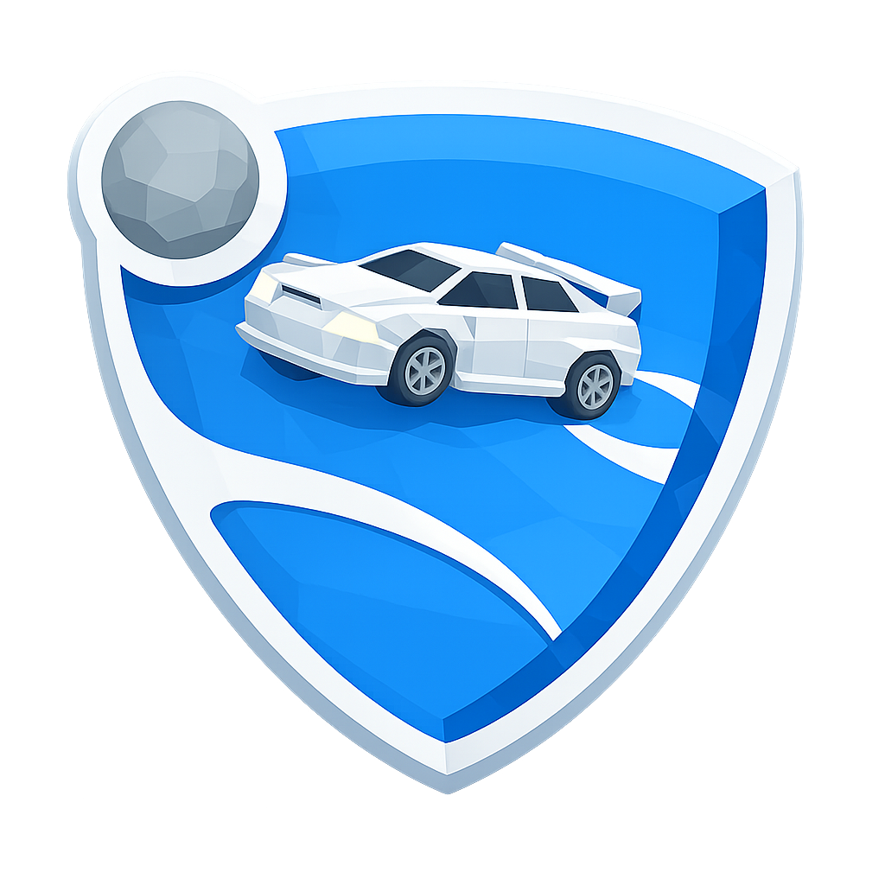

# Arcade Car Soccer

A third-person, 3D, arcade car-soccer game for Linux — rocket-powered cars playing football inside an
enclosed futuristic arena. Native C++ with [raylib](https://github.com/raysan5/raylib) for graphics,
[Jolt](https://github.com/jrouwe/JoltPhysics) for physics, [glm](https://github.com/g-truc/glm) for
maths and [Dear ImGui](https://github.com/ocornut/imgui) for the in-engine tuning tools.

## The game

Pick one of six low-poly cars, then kick off in a 55 x 80 m glass-walled arena. Drive, boost, jump,
double-jump, flip and fly: every edge of the arena is ramped like Rocket League, so you can carry a
wall and, with enough boost, cross the ceiling. Put the heavy-but-bouncy ball fully across the
opponent's goal line to score. The match runs on a clock, a goal resets the field with a kickoff
countdown, and boost is a 0-100 meter drained by holding Shift and refilled by 18 pads spread around
the pitch. **C** swaps between the chase camera and a ball cam that keeps the ball and the car lined
up in frame.

Priority is fun over realism: the car is a single box body driven by arcade forces rather than a
simulated suspension, so acceleration is strong, cornering is drift-friendly and the car rights
itself after a tumble.

The main menu carries a **How to play** screen with the rules and the full control list.

**Current state:** playable solo — there is no opponent yet (see the milestone checklist below).
<p align="center">
  
</p>

# Budget League

## About
A Rocket League-like game with low-poly graphics. The main idea behind the project was to create a "demake" of Rocket League with visuals inspired by games from the early 90s. I tried to recreate some of its core mechanics, such as boosting and driving up walls and ramps. There are still some bugs, and the game is still under development.

If everything goes well, I want to implement a split screen two-player mode  (2v2 - 1v1) and online multiplayer as a proof of concept. The arena, ball, goals, boost pads, UI and every sound effect are procedural — the sound cues are synthesised at startup from a table. The only imported art is the Quartenius Cars Pack

## Stack

- **Platform:** Linux
- **Language:** C++ (GCC / Makefile), with Python for the build tools
- **Graphics:** [raylib](https://github.com/raysan5/raylib)
- **Physics:** [Jolt](https://github.com/jrouwe/JoltPhysics)
- **Math:** [glm](https://github.com/g-truc/glm)
- **Debug/tuning UI:** [Dear ImGui](https://github.com/ocornut/imgui)
- **Assets:** cooked by `Tools/AssetCooker.py` as a build event

## Controls

### Driving

| Input | Action |
|---|---|
| **W / S** or **Up / Down** | Accelerate / brake and reverse |
| **A / D** or **Left / Right** | Steer |
| **Space** | Jump — press again in the air for a double jump, or a flip if a direction is held |
| **Shift** (hold) | Boost |
| **W / A / S / D** (airborne) | Pitch and yaw |
| **Q / E** (airborne) | Air roll |
| **C** | Toggle chase cam / ball cam |
| **R** | Reset the car to its spawn |
| **Esc** or **P** | Pause |

### Menus

| Input | Action |
|---|---|
| **Up / Down** or **W / S** | Move between rows |
| **Left / Right** or **A / D** | Change a setting's value |
| **Enter** / **Space** | Activate |
| **Esc** | Close the settings panel / go back |
| Mouse | Hover to select, click to activate |

### Car picker

| Input | Action |
|---|---|
| **Arrows** or **WASD** | Move around the 2 x 3 grid |
| **Enter** / **Space** | Start the match with the highlighted car |
| **Esc** | Back to the main menu |
| Left click | Pick a car |
| **Right click a car** | Pick it and start the match in one go |

## How to run

### Requirements

- Linux, GCC with C++17, `make`, Python 3 (the asset cooker runs as a build event).
- OpenGL development libraries and X11 (raylib's own dependencies).

### Get the third-party libraries

They are not vendored in this repository. Clone them into `Game/ThirdParty/` at the pinned versions —
mismatching them, Jolt especially, causes silent ABI breakage:

```sh
git clone --branch 6.0            --depth 1 https://github.com/raysan5/raylib.git      Game/ThirdParty/raylib
git clone --branch v5.6.0         --depth 1 https://github.com/jrouwe/JoltPhysics.git  Game/ThirdParty/Jolt
git clone --branch 1.0.3          --depth 1 https://github.com/g-truc/glm.git          Game/ThirdParty/glm
git clone --branch v1.92.9b-docking --depth 1 https://github.com/ocornut/imgui.git     Game/ThirdParty/imgui
```

### Build

```sh
make                 # Development (default)
make debug           # or: make development / make release / make all
```

The first build takes a few minutes (raylib plus 153 Jolt translation units per configuration); after
that it is incremental. `make clean` removes the build output, `make clean-thirdparty` also forces a
raylib rebuild.

Each configuration lands in `Build/<Config>/` next to an `assets/` folder of cooked models and
shaders, written by `Tools/AssetCooker.py` as part of the build.

| Configuration | Debug symbols | ImGui tuning tools | Optimisation |
|---|:---:|:---:|---|
| Debug | yes | yes | `-O0` |
| Development | yes | yes | `-O2` |
| Release | no | no | `-O3` |

### Run

```sh
make run CONFIG=Development
# or directly
./Build/Release/ArcadeCarSoccer
```

Headless-ish validation — render N frames, write a screenshot and exit:

```sh
./Build/Release/ArcadeCarSoccer --smoke-test 60 --screenshot SmokeTest.png
```

The Python tools need no dependencies today; when the cooker starts using Pillow/numpy, create the
environment with `python3 -m venv .venv && .venv/bin/pip install -r Tools/requirements.txt` and the
Makefile will pick it up automatically.

## Milestones

Tracked against the milestone list in [CLAUDE.md](CLAUDE.md); implementation notes, measurements and
design decisions live in [HANDOFF.md](HANDOFF.md).

- [x] **01 — Project Structure** — all three configurations build, the asset cooker runs as a build event.
- [x] **02 — Base Scene and Car Movement** — arena floor, chase camera, a car on a single Jolt rigid body.
- [x] **03 — Main Menu and Pause Menu** — Play / Settings / Exit, Esc-or-P pause overlay, one settings panel shared by both.
- [x] **04 — Car Handling and Feel** — 0-100 km/h in 1.63 s, 32 m/s top speed, rights itself from upside down in 0.78 s.
- [x] **05 — Ball and Car-Ball Interaction** — heavy sphere with its own gravity factor; a top-speed hit sends it out at 1.19x the car's speed.
- [x] **06 — Arena, Goals and Scoring** — enclosed arena, two goals, exact "fully across the line" detection, clock, kickoff countdown and reset.
- [x] **07 — Boost System and Boost Pads** — 0-100 meter, 3 s of boost from full, 18 pads with cooldown and glow.
- [x] **08 — Car Selection** — six of the seven cooked cars on a 2 x 3 grid, shown after Play; the pick carries into the match.
- [x] **09 — Jumps, Flips and Air Control** — single and double jump, directional flips, pitch/yaw/roll in the air, aerial ball touches.
- [x] **10 — Camera Modes** — smooth chase cam, ball cam on **C**, and the camera keeps itself out of the arena geometry by ray cast rather than clipping through it.
- [ ] **11 — HUD** — score, clock and boost meter exist as a placeholder readout in `MatchScene`; the real HUD widget, pad hints and goal banner are still to do.
- [ ] **12 — Bot Opponent (or Solo Practice)** — no opponent car yet; `CarInput` already carries everything a bot needs.
- [ ] **13 — Tuning Panels (Debug/Development)** — ImGui is linked and `GAME_DEV_TOOLS` is defined, but no panels are drawn and nothing is saved to a config.
- [ ] **14 — Visual Polish and Effects** — flat-shaded lighting was pulled forward and is done; shadows, bloom, boost flame/trail and goal particles are not.
- [ ] **15 — Audio** — not started; the audio device is not initialised and the volume settings are stored but unused.
- [ ] **16 — UI Polish (raygui)** — not started; the UI is drawn with the project's own `uistyle` helpers.

### Final milestone — polish

- [x] Minor bumps never flip the car, while intentional flips stay snappy.
- [x] The ball is heavy but not sluggish; big hits carry.
- [x] The kickoff reset settles cleanly, with physics simply not stepped while frozen.
- [x] Chase-camera clipping near walls — the camera is pulled in, and trades distance for height when there is none.
- [x] Ball-cam framing keeps the ball and the car readable, including at speed.
- [ ] Screen and particle punch on goals and big hits.
- [ ] Boost flame/trail scaling with boost use.
- [x] Boost-pad glow reads ready vs cooldown.
- [ ] Bot behaviour — waits on milestone 12.
- [ ] Post-processing degrading gracefully — the setting is stored but nothing consumes it yet.
- [x] No major errors in the log during a run.

## Layout

```
Game/Source/       game code (scenes, GameObjects, systems)
Game/ThirdParty/   raylib, Jolt, glm, imgui (cloned, git-ignored)
Game/Assets/       Cars-Park car pack and the lit shader
Tools/             AssetCooker.py, FbxReader.py
Build/<Config>/    ArcadeCarSoccer + cooked assets
```

## Credits

Car models from the Cars-Park low-poly pack (`Game/Assets/Cars-Park/License.txt`). Everything else —
arena, ball, goals, boost pads, UI — is procedural.
| Key | Action |
|-----|--------|
| `W` / `↑` | Accelerate |
| `S` / `↓` | Reverse / brake |
| `A` `D` / `←` `→` | Steer |
| `Shift` | Boost |
| `Space` | Jump (press again for a double jump / flip) |
| `R` | Reset car |

### In the air

| Key | Action |
|-----|--------|
| `W` / `S` | Pitch (nose down / nose up) |
| `A` / `D` | Yaw |
| `Q` / `E` | Roll |

### Menus

| Key | Action |
|-----|--------|
| `Esc` / `P` | Pause and resume the match |
| Mouse | Navigate the main menu, pause menu and settings |

## Assets Used
- [Cars Pack](https://quaternius.com/packs/cars.html)
